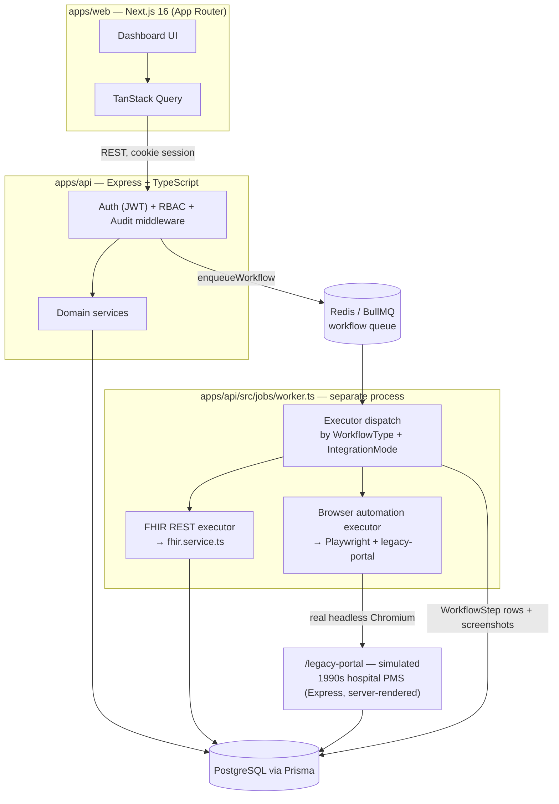

# OpenEHR Bridge

**Autonomous Healthcare Workflow Engine** — an internal operations platform for Confido Health, built to demonstrate how a hospital front desk automates patient registration, appointment management, and insurance verification, with a browser-automation fallback for legacy systems that have no API.

> **Status: Phase 2 — Automation Engine, Browser Automation & FHIR Adapter.** Phase 1 delivered the production-grade skeleton (data model, authenticated REST API with RBAC and audit logging, operations dashboard). Phase 2 adds the parts that make it a real workflow _engine_: a BullMQ-backed job queue with retry/backoff/dead-letter handling, a Playwright-driven browser-automation fallback against a simulated legacy hospital portal, and a mock FHIR R4 adapter — all wired into the dashboard's Automation, Browser Automation, and FHIR pages. The AI Assistant and Smart Patient Intake (voice + mock DigiLocker OCR) remain Phase 3. See [Production Roadmap](#production-roadmap).

---

## Table of Contents

- [Motivation](#motivation)
- [Architecture](#architecture)
- [Folder Structure](#folder-structure)
- [Technology Choices](#technology-choices)
- [Healthcare Workflows](#healthcare-workflows)
- [FHIR](#fhir)
- [Browser Automation Fallback](#browser-automation-fallback)
- [Reliability & Retry Strategy](#reliability--retry-strategy)
- [Security](#security)
- [Installation](#installation)
- [Environment Variables](#environment-variables)
- [API Documentation](#api-documentation)
- [Deployment](#deployment)
- [Screenshots & Demo](#screenshots--demo)
- [Known Limitations](#known-limitations)
- [Production Roadmap](#production-roadmap)

---

## Motivation

Hospital front desks run on a patchwork of legacy portals, spreadsheets, and manual phone calls. OpenEHR Bridge is a reference implementation of what an internal automation layer over that patchwork looks like: a single operations console where staff (and eventually an AI agent) register patients, book and manage appointments, verify insurance, and see every automated action recorded in an audit trail — whether that action happened through a modern FHIR API or, when no API exists, through simulated browser automation against a legacy portal.

It is built as **software nurses and receptionists would actually use**: calm, high-contrast, keyboard-friendly, and honest about what's real versus simulated in a demo environment.

## Architecture



**Request flow:** the dashboard is a client-rendered SPA-style app that authenticates via an httpOnly session cookie and talks to the API over REST through a typed TanStack Query layer. Every mutating API call runs through `requireAuth` → `requirePermission` → the domain service → `recordAuditLog`, so audit coverage is structural, not opt-in per-route.

**Workflow execution flow:** triggering a workflow (e.g. "book appointment") calls `enqueueWorkflow()`, which creates an `AutomationJob` row and adds a job to the `workflow-engine` BullMQ queue. A **separate worker process** (`npm run dev:worker`) picks it up, dispatches to an executor based on `WorkflowType` + `IntegrationMode`, and records one `WorkflowStep` row per step — so the dashboard's execution timeline is reading the same rows the worker is writing, live, via polling.

**Shared types** (`packages/shared`) are hand-written domain types + an `RBAC` permission map, imported by both apps, so the frontend can gate UI by role without duplicating the authorization model or depending on Prisma internals.

## Folder Structure

```
openehr-bridge/
├── apps/
│   ├── api/                    # Express + TypeScript + Prisma
│   │   ├── prisma/
│   │   │   ├── schema.prisma   # Core data model
│   │   │   └── seed.ts         # Demo organization, users, doctors, patient
│   │   └── src/
│   │       ├── config/         # Zod-validated env
│   │       ├── controllers/    # Request/response glue
│   │       ├── services/       # Business logic, Prisma queries
│   │       ├── middleware/     # auth, RBAC, request context, error handling
│   │       ├── routes/         # Express routers (+ OpenAPI JSDoc)
│   │       ├── jobs/            # BullMQ queue, worker, executors, step runner, Playwright script
│   │       ├── legacyPortal/    # Simulated legacy hospital portal (server-rendered HTML)
│   │       └── lib/            # logger, prisma client, masking, pagination, redis
│   └── web/                     # Next.js 16 App Router + shadcn/ui
│       ├── app/
│       │   ├── (dashboard)/    # Authenticated shell: sidebar + topbar + pages
│       │   │   └── automation/[id]/  # Workflow execution timeline + screenshots
│       │   └── login/
│       ├── components/
│       │   ├── ui/             # shadcn/ui primitives
│       │   ├── layout/         # Sidebar, Topbar, Command Palette
│       │   └── shared/         # PageHeader, StatCard, EmptyState, StatusBadge
│       ├── lib/queries/        # TanStack Query hooks, one file per domain
│       └── store/              # Zustand UI state (sidebar, command palette)
├── packages/
│   └── shared/                  # Cross-app types + RBAC permission map
├── docker-compose.yml           # Postgres + Redis for local dev
└── .github/workflows/ci.yml     # Lint, typecheck, test, build
```

## Technology Choices

| Layer              | Choice                              | Why                                                                                                     |
| ------------------ | ----------------------------------- | ------------------------------------------------------------------------------------------------------- |
| Frontend framework | Next.js 16 (App Router)             | Server-first routing conventions, first-class TypeScript, deploys anywhere                              |
| UI kit             | shadcn/ui + Tailwind v4             | Owned component code (not a black-box library) — easy to restyle to the healthcare-calm design language |
| Data fetching      | TanStack Query                      | Caching, retries, optimistic updates, and loading/error states out of the box                           |
| Client state       | Zustand                             | Tiny, no boilerplate, used only for UI-local state (sidebar collapse, command palette)                  |
| Forms              | React Hook Form + Zod               | Same validation schema shape as the API's Zod schemas                                                   |
| Charts             | Recharts                            | Composable, themeable via CSS variables                                                                 |
| Backend framework  | Express + TypeScript                | Simple, explicit middleware chain — easy to reason about auth/RBAC/audit ordering                       |
| ORM                | Prisma                              | Type-safe queries, migrations, and a schema that doubles as living documentation                        |
| Database           | PostgreSQL                          | Relational integrity for appointment conflicts, idempotency keys, audit trails                          |
| Job queue          | BullMQ + Redis                      | Retry/backoff/dead-letter semantics for the automation engine, running as a separate worker process     |
| Browser automation | Playwright (Chromium)               | Real headless-browser control for the legacy-portal fallback — not a simulation of a simulation         |
| Validation         | Zod                                 | Single source of truth for request shapes, shared between routes and forms                              |
| Auth               | JWT in an httpOnly, sameSite cookie | No token in JS-readable storage; safer default for a first-party dashboard                              |

## Healthcare Workflows

The data model (`apps/api/prisma/schema.prisma`) supports the full workflow set, and three are fully wired end-to-end through the automation engine:

- **Patient registration** — `Patient` model with soft-delete, MRN generation, masked PII (Aadhaar, insurance).
- **Identity verification** — `verificationStatus`/`verificationScore` fields on `Patient`, populated by the future Smart Patient Intake flow (Phase 3).
- **Appointment booking** (`executeAppointmentBooking`) — routed through the workflow engine (`POST /workflows/appointment-booking`), executed via either the FHIR path or the Playwright browser-automation path, both converging on the same `createAppointment()` call so the resulting record is identical either way.
- **Reschedule / cancellation** — exposed directly on `/appointments/:id/reschedule` and `/cancel`; not yet routed through the job queue (no realistic retry story for a same-request operation).
- **Insurance verification** (`executeInsuranceVerification`) — routed through the workflow engine (`POST /workflows/insurance-verification`), wrapping the simulated eligibility check in a tracked `WorkflowStep`.
- **Patient lookup** (`executePatientLookup`) — a directory-query workflow, mostly present to demonstrate the pattern for a read-only workflow with no side effects to retry.
- **Automation / workflow timeline** — `AutomationJob` + `WorkflowStep` rows are written live by the worker process and read by the `/automation/:id` detail page (polled every 2s while the job is in flight): status (`PENDING → RUNNING → SUCCESS | FAILED | RETRYING | DEAD_LETTER`), attempt count, duration, and per-step screenshots.
- **Audit logging** — every mutation records actor, action, before/after snapshot, duration, correlation ID, and trace ID via `recordAuditLog()`, called from controllers _and_ from the worker (`workflow.<type>.completed` actions), so automated and human-initiated actions land in the same trail.

## FHIR

`apps/api/src/services/fhir.service.ts` maps domain models to minimal, spec-shaped FHIR R4 resources — `Patient`, `Practitioner`, `Appointment`, `Coverage` today (Encounter/Observation/Condition/Medication/DiagnosticReport/Organization are modeled in the `FhirResource` table's `resourceType` union but have no generator yet). Two ways resources get created:

- **Batch sync** — `POST /fhir/sync` (the "Sync from database" button on `/fhir`) regenerates every resource from current Patient/Doctor/Appointment/Insurance rows, version-bumping existing ones.
- **Incremental, FHIR-path bookings** — when `executeAppointmentBooking` runs with `integrationMode: FHIR_REST`, it calls `syncAppointmentResource()` as one of its workflow steps, so a fresh Appointment resource appears immediately without waiting for the next batch sync.

The **Integration Engine** (`IntegrationMode` enum: `FHIR_REST` | `BROWSER_AUTOMATION`) is what lets the same `enqueueWorkflow()` call transparently choose a path: `chooseIntegrationMode()` prefers an organization's enabled `FHIR_REST` integration and falls back to `BROWSER_AUTOMATION` otherwise, or a caller can force either path explicitly (the dashboard's "Run Demo Workflow" dialog does this, so both paths are easy to demo side by side).

## Browser Automation Fallback

`/legacy-portal` (`apps/api/src/legacyPortal/`) is a real, server-rendered mock of a hospital practice-management system that looks like it hasn't been touched since 2006 — plain HTML forms, no client-side JS, a single shared staff login (`frontdesk` / `legacy123`), and an in-memory session store. It has its own login, patient search, booking form, and confirmation pages, all reading/writing the same Postgres database as the rest of the app.

`apps/api/src/jobs/playwrightBooking.ts` drives it with a **real headless Chromium browser** (Playwright, not a mock): log in → search for the patient by MRN → fill and submit the booking form → read back the confirmation number — screenshotting every step to `apps/api/storage/screenshots/<jobId>/`, served at `/storage/screenshots/...` and rendered inline on the `/automation/:id` and `/browser-automation` pages. The `search_patient` step has a **40% simulated transient-failure rate on the first attempt only**, specifically so a demo run reliably shows the retry/backoff behavior at least some of the time without being flaky forever.

## Reliability & Retry Strategy

- **Idempotency keys** on appointment creation (`Appointment.idempotencyKey`) and automation jobs (`AutomationJob.idempotencyKey`) — a retried "book appointment" step, or a resubmitted workflow request, returns the existing record instead of creating a duplicate. The browser-automation path additionally scopes its booking-form idempotency key to `<jobId>-book` so a mid-workflow retry (e.g. the search step failing) never causes a double-submit of the form on the next attempt.
- **Optimistic conflict checks** — booking/rescheduling rejects overlapping doctor slots with a `409 Conflict` rather than silently double-booking.
- **Exponential backoff & retry** — every workflow job gets 3 attempts with BullMQ's exponential backoff (`{ type: "exponential", delay: 2000 }`). Each attempt re-runs the full executor from scratch (fresh browser session for the automation path) and writes a new set of `WorkflowStep` rows, so the timeline shows the full retry history, not just the final outcome.
- **Dead-letter state** — `JobStatus.DEAD_LETTER` once all attempts are exhausted (set by the worker's `failed` event handler), surfaced with the same red status badge as `FAILED` everywhere in the UI, but distinguishable via the audit log and job detail page.
- **Structured error taxonomy** (`AppError` subclasses: `NotFoundError`, `ValidationError`, `UnauthorizedError`, `ForbiddenError`, `ConflictError`) mapped to consistent HTTP status codes and JSON error shapes.
- **Audit logging that never fails the request it observes** — `recordAuditLog` swallows and logs its own errors rather than propagating them.
- **Resilient Redis connection** — a missing/unavailable Redis logs a warning instead of crashing the API process (enqueueing degrades; reads still work).
- **Rate limiting** on `/auth/login` to slow credential-stuffing attempts.
- **Graceful shutdown** — `SIGTERM`/`SIGINT` drain in-flight requests before exiting.

Not yet implemented (see [Known Limitations](#known-limitations)): circuit breakers that automatically mark an integration unhealthy and reroute future jobs, and per-step timeouts independent of the browser/HTTP call's own timeout.

## Security

- **PII masking at rest**: raw Aadhaar numbers and insurance policy numbers are never persisted — only the masked form (`lib/mask.ts`) is stored, so a database compromise exposes nothing beyond the last 4 digits.
- **RBAC / least privilege**: five roles (`ADMIN`, `DOCTOR`, `RECEPTIONIST`, `NURSE`, `AUDITOR`) map to an explicit permission list in `packages/shared`, enforced server-side by `requirePermission()` middleware and mirrored client-side to hide actions a role can't perform.
- **Session cookies**: httpOnly, `sameSite=lax`, `secure` in production, with a configurable idle timeout (`SESSION_IDLE_TIMEOUT_MINUTES`).
- **Rate limiting** on the login endpoint.
- **Helmet** security headers, strict CORS allow-list (`WEB_ORIGIN`), and `express.json()` body-size limits.
- **Structured audit trail** as a security control, not just an operational one — every read of this document should assume "if it mutated data, it's in `audit_logs`."
- **Zod validation at every API boundary** — no unvalidated request body reaches a Prisma call.

## Installation

### Prerequisites

- Node.js 24+
- Docker Desktop (for local Postgres + Redis) — or point `DATABASE_URL` at your own Postgres instance

### Steps

```bash
# 1. Install dependencies (npm workspaces — one install for both apps)
npm install

# 2. Start Postgres + Redis
docker compose up -d

# 3. Configure environment
cp apps/api/.env.example apps/api/.env
cp apps/web/.env.local.example apps/web/.env.local

# 4. Generate the Prisma client, run migrations, seed demo data
npm run db:generate --workspace=apps/api
npm run db:migrate --workspace=apps/api
npm run db:seed --workspace=apps/api

# 5. Install the Chromium browser Playwright drives against the legacy portal
npx playwright install chromium --with-deps

# 6. Run the API, the workflow worker, and the web app together
npm run dev
# API:     http://localhost:4000  (Swagger at /api/docs)
# Web:     http://localhost:3000
# Worker:  runs in the same terminal (labeled "worker"), no port of its own
```

The API server and the workflow worker are **separate processes** (`npm run dev` starts both via `concurrently`) — the worker is what actually executes automation jobs; without it, jobs enqueued via `/workflows/*` will sit in `PENDING` forever. If you only need to browse the dashboard without running workflows, `npm run dev:api` and `npm run dev:web` are enough.

Seeded demo accounts (password for all: `Password123!`):

| Email                          | Role         |
| ------------------------------ | ------------ |
| `admin@confidohealth.demo`     | ADMIN        |
| `reception@confidohealth.demo` | RECEPTIONIST |
| `dr.nair@confidohealth.demo`   | DOCTOR       |
| `auditor@confidohealth.demo`   | AUDITOR      |

> **Note on Windows ARM64**: `apps/api/prisma/schema.prisma` sets `engineType = "binary"` because Prisma's default library engine (an in-process native module) can't load on ARM64 Windows hosts. If you're on x64, this still works — it just runs the query engine as a spawned subprocess instead of an in-process library.

## Environment Variables

**`apps/api/.env`** (see `apps/api/.env.example`):

| Variable                       | Purpose                                                                                     |
| ------------------------------ | ------------------------------------------------------------------------------------------- |
| `DATABASE_URL`                 | Postgres connection string                                                                  |
| `REDIS_URL`                    | Redis connection string — required by both the API (to enqueue) and the worker (to consume) |
| `JWT_SECRET`                   | Session token signing secret — generate with `openssl rand -hex 32`                         |
| `JWT_EXPIRES_IN`               | Token lifetime (default `8h`)                                                               |
| `COOKIE_SECURE`                | Set `true` behind HTTPS in production                                                       |
| `WEB_ORIGIN`                   | Allowed CORS origin for the dashboard                                                       |
| `SESSION_IDLE_TIMEOUT_MINUTES` | Auth cookie max age                                                                         |
| `GEMINI_API_KEY`               | Optional — enables real OCR/voice in Phase 3; unset runs on mocks                           |

**`apps/web/.env.local`** (see `apps/web/.env.local.example`):

| Variable              | Purpose                                    |
| --------------------- | ------------------------------------------ |
| `NEXT_PUBLIC_API_URL` | Base URL of the API the dashboard talks to |

## API Documentation

Interactive Swagger UI is served at **`/api/docs`** on the running API (OpenAPI 3.0 spec generated from JSDoc annotations in `apps/api/src/routes/*.ts`). Health check: `GET /health`.

Core resource routes (all under `/api/v1`, all requiring auth except `/auth/login`):

```
POST   /auth/login                    /auth/logout             GET /auth/me
GET    /patients                      POST /patients           GET/PATCH/DELETE /patients/:id
GET    /doctors                       GET /doctors/available    POST/PATCH/DELETE /doctors/:id
GET    /appointments                  POST /appointments        PATCH /appointments/:id/reschedule
                                                                 PATCH /appointments/:id/cancel
GET    /insurance                     POST /insurance           POST /insurance/:id/verify
GET    /audit-logs
GET    /organizations/:id             PATCH /organizations/:id
GET    /automation-jobs               GET /automation-jobs/:id  (?integrationMode=FHIR_REST|BROWSER_AUTOMATION)
GET    /dashboard/summary

# Workflow engine (enqueues a job; 202 Accepted with the AutomationJob row)
POST   /workflows/appointment-booking
POST   /workflows/insurance-verification

# FHIR mock adapter
GET    /fhir/:resourceType            GET /fhir/resource/:id    POST /fhir/sync
```

Outside `/api/v1` and unauthenticated by design:

```
GET/POST /legacy-portal/login         GET /legacy-portal/search
GET      /legacy-portal/search-results   GET/POST /legacy-portal/book
GET      /legacy-portal/confirmation/:appointmentId
GET      /storage/screenshots/:jobId/:file.png   (captured automation screenshots)
```

## Deployment

Each app has a multi-stage `Dockerfile` (`apps/api/Dockerfile`, `apps/web/Dockerfile`) that builds `packages/shared` first, then the target app, producing a slim production image. A typical deployment:

1. Provision managed Postgres and Redis (e.g. Neon/RDS + Upstash/ElastiCache).
2. Build and push both images (`docker build -f apps/api/Dockerfile .`, same for web) with `DATABASE_URL`, `JWT_SECRET`, `REDIS_URL` supplied as runtime secrets.
3. Run `npx prisma migrate deploy` against the production database as a release step before starting the new API version.
4. Point the web app's `NEXT_PUBLIC_API_URL` at the deployed API's public URL and set `COOKIE_SECURE=true` + `WEB_ORIGIN` to the deployed web origin on the API.
5. Put both services behind your platform's TLS termination (the API never terminates TLS itself).

`.github/workflows/ci.yml` runs lint, typecheck, tests (against a real Postgres service container), and both production builds on every push/PR — treat a red CI run as a deploy blocker.

## Screenshots & Demo

_Placeholders — populate once the UI is running against seeded data:_

- `docs/screenshots/dashboard.png` — Dashboard with live stats and workflow breakdown
- `docs/screenshots/patients.png` — Patient list and registration dialog
- `docs/screenshots/appointments.png` — Appointment list with status and integration-mode columns
- `docs/screenshots/automation-timeline.png` — A browser-automation job's step-by-step timeline with screenshots
- `docs/screenshots/legacy-portal.png` — The simulated MediTrack legacy portal Playwright drives
- `docs/demo.gif` — End-to-end walkthrough: login → register patient → run booking workflow (browser automation) → watch the timeline → view audit log

## Known Limitations

- **AI Assistant and Smart Patient Intake are still Phase 3**: represented in the data model (`Conversation`/`ConversationMessage`, `Patient.verificationStatus`) and navigation, but the `/assistant` page is a placeholder — no voice, camera, or OCR yet.
- **Only 3 of 7 workflow types have executors**: `APPOINTMENT_BOOKING`, `INSURANCE_VERIFICATION`, and `PATIENT_LOOKUP` run through the automation engine. `REGISTRATION`, `IDENTITY_VERIFICATION`, `APPOINTMENT_RESCHEDULE`, and `APPOINTMENT_CANCELLATION` exist as enum values but have no executor registered — enqueuing them would throw `"No executor registered..."` in the worker.
- **The worker must be running separately**: `npm run dev` starts it automatically, but if you only ran `dev:api` and `dev:web`, enqueued jobs will sit in `PENDING` forever — this is a common "why isn't anything happening" trap worth remembering.
- **FHIR resource coverage is partial**: only Patient, Practitioner, Appointment, and Coverage have generators in `fhir.service.ts`; Encounter/Observation/Condition/Medication/DiagnosticReport/Organization are schema-modeled placeholders with no data.
- **No circuit breaker yet**: `chooseIntegrationMode()` checks whether an integration is _enabled_, not whether it's currently _healthy_ — a flapping FHIR integration won't automatically fail over to browser automation mid-outage the way a real circuit breaker would.
- **Single-organization assumption in the UI**: the API is multi-tenant at the schema level (`organizationId` on every relevant table), but the dashboard currently scopes all views to the signed-in user's own organization with no org-switcher.
- **Insurance verification is simulated**: `insurance.service.ts` deterministically derives an outcome rather than calling a real payer eligibility API.
- **No patient detail page yet**: patient records are viewable in the list but don't yet have a dedicated profile route (appointments/insurance history, edit form, or a per-patient "run insurance verification" button).
- **Live updates are polled, not pushed**: the job detail page polls every 2s while a job is in flight; a WebSocket/SSE push would be more efficient at scale.

## Production Roadmap

- **Phase 3 — Smart Patient Intake**: camera-based presence detection, multilingual voice greeting (Gemini STT/TTS), mock DigiLocker OCR (Gemini Vision) with confidence scoring and face-match animation, feeding directly into `Patient` creation.
- **Phase 3 — AI Assistant**: conversational booking/rescheduling/lookup with function calling against the same `enqueueWorkflow()`/service functions the REST API uses, `Conversation`/`ConversationMessage` already modeled.
- **Phase 3 — Remaining executors**: wire `REGISTRATION`, `IDENTITY_VERIFICATION`, `APPOINTMENT_RESCHEDULE`, and `APPOINTMENT_CANCELLATION` into the automation engine so every `WorkflowType` is actually runnable.
- **Phase 4 — Hardening**: real circuit breaker (health-tracked per `Integration`, automatic failover mid-outage rather than just "is it enabled"), per-step timeouts independent of the underlying call, E2E test suite (Playwright against the dashboard itself, not just the legacy portal), patient detail pages, org-switcher for true multi-tenant admin use, real payer eligibility integration, WebSocket/SSE push in place of polling for the job timeline.
